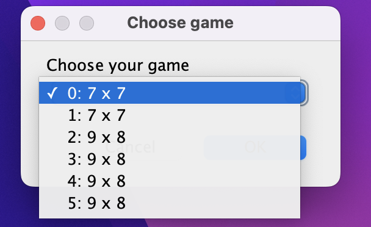
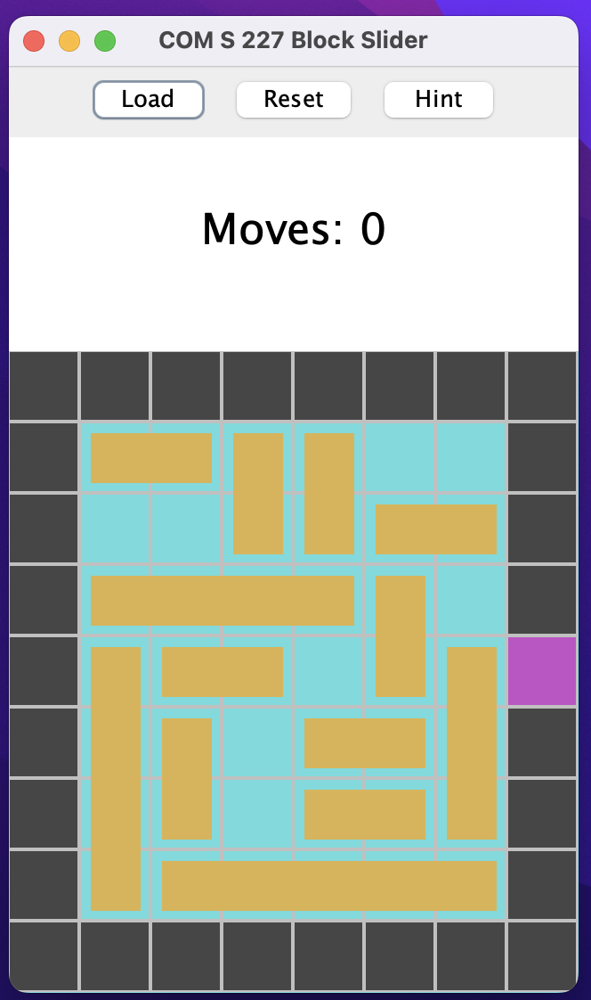

# Block Maze


A Java-based block sliding puzzle game featuring a complete puzzle engine, block movement implementation, and a GUI-based interface.

## Table of Contents
- [Overview](#overview)
- [Tech Stack](#tech-stack)
- [Directory Structure](#directory-structure)
- [Modules and Functions](#modules-and-functions)
  - [Game Logic](#game-logic)
  - [Block Movement](#block-movement)
  - [Board Management](#board-management)
  - [User Interface](#user-interface)
  - [File I/O](#file-io)
- [Usage](#usage)

---

## Overview

This is a complete block sliding puzzle game implementation written in Java. It includes all standard puzzle mechanics, including block movement validation, path finding, and win condition detection. The game is played through a graphical user interface using Swing components.

---

## Tech Stack

### Core
- **Java** — Object-oriented programming language
- **Java Swing** — GUI framework for user interface
- **Java Collections** — Used for managing board and blocks

### Game Engine
- **Custom Block Classes** — Block representation with orientation and size
- **Board Management** — 2D array-based board structure
- **Movement Validation** — Rule-checking for legal moves
- **Path Finding** — Algorithm for solving puzzles

### User Interface
- **Swing Components** — JFrame, JPanel, JButton for GUI
- **Event Handling** — Mouse and keyboard input processing

### Data Management
- **Text File Parsing** — Load puzzle configurations from files
- **Grid Utilities** — Parse string descriptions to create game boards

---

## Directory Structure

```
src/
  api/
    Cell.java              # Cell representation (WALL, FLOOR, EXIT)
    CellType.java          # Enum for cell types
    Direction.java         # Direction constants
    Move.java              # Move representation
    Orientation.java       # Block orientation (HORIZONTAL, VERTICAL)
    DescriptionUtil.java   # Utility for parsing descriptions
  block_maze/
    Board.java             # Main board management and game logic
    Block.java             # Block representation and movement
    Solver.java            # Puzzle solving algorithm
    GridUtil.java          # Grid parsing utilities
  ui/
    GameMain.java          # Main game controller and GUI setup
    BoardPanel.java        # Game board display panel
    ButtonPanel.java       # Control buttons panel
    ScorePanel.java        # Score and move counter display
  SimpleTests.java         # Test cases for game functionality
games.txt                  # Puzzle configuration files
```

---

## Modules and Functions

### Game Logic

**File:** `ui/GameMain.java`  
- `main(String[] args)` – Starts the GUI application  
- `create()` – Sets up the game board and UI components  
- Manages game initialization with test grids and blocks  
- Handles Swing event thread management

### Block Movement

**File:** `block_maze/Block.java`  
- Block representation with position, size, and orientation  
- `move(Direction)` – Validates and executes block movement  
- `isValidMove(Board, Direction)` – Checks if move is legal  
- `getBounds()` – Returns block's occupied positions

### Board Management

**File:** `block_maze/Board.java`  
- 2D grid represented with Cell objects  
- `moveBlock(Block, Direction)` — Validates and performs block moves  
- `isGameOver()` — Returns true if exit is reached  
- `getCell(row, col)` / `setCell(row, col, cell)` — Read/write board cells  
- `toString()` — Text representation of current board

**File:** `block_maze/GridUtil.java`  
- `createGrid(String[][])` — Parses string descriptions to create Cell grid  
- `findBlocks(String[][])` — Extracts Block objects from grid description  
- Maps characters to Cell types and Block configurations

### User Interface

**File:** `ui/GameMain.java`  
- Swing-based GUI using JFrame and JPanel  
- Displays board with colored cells and blocks  
- Provides control buttons for game actions  
- Shows score and move counter

**File:** `ui/BoardPanel.java`  
- Renders the game board with visual representation  
- Handles mouse interactions for block selection  
- Updates display when board state changes

**File:** `ui/ButtonPanel.java`  
- Contains control buttons (Reset, Undo, etc.)  
- Manages game state through button actions

**File:** `ui/ScorePanel.java`  
- Displays current score and move count  
- Updates in real-time as game progresses

### File I/O

**File:** `games.txt`  
- Contains multiple puzzle configurations  
- Each puzzle defined with character grid:
  - `*` = Wall
  - `.` = Floor  
  - `e` = Exit
  - `[`, `]`, `^`, `v`, `#` = Block parts

---

## Usage

### How to compile and start the game
```bash
mkdir -p out
find src -name "*.java" | xargs javac -d out
java -cp out ui.GameMain
```

### How to change difficulty

- **Click Load:** Click load and go to the Block_Maze/games.txt and open the .txt file.

- **Select the size of board:** You will see options for the game like picture above.
- **Select and play:** Select one of the options and play.


### Gameplay
- **Board Display:** Shows puzzle grid with colored cells and blocks
- **Block Movement:** Click and drag blocks or use arrow keys
- **Objective:** Move blocks to reach the exit (magenta cell)
- **Controls:** Reset button to restart, Undo to reverse moves
- **Scoring:** Tracks number of moves made

